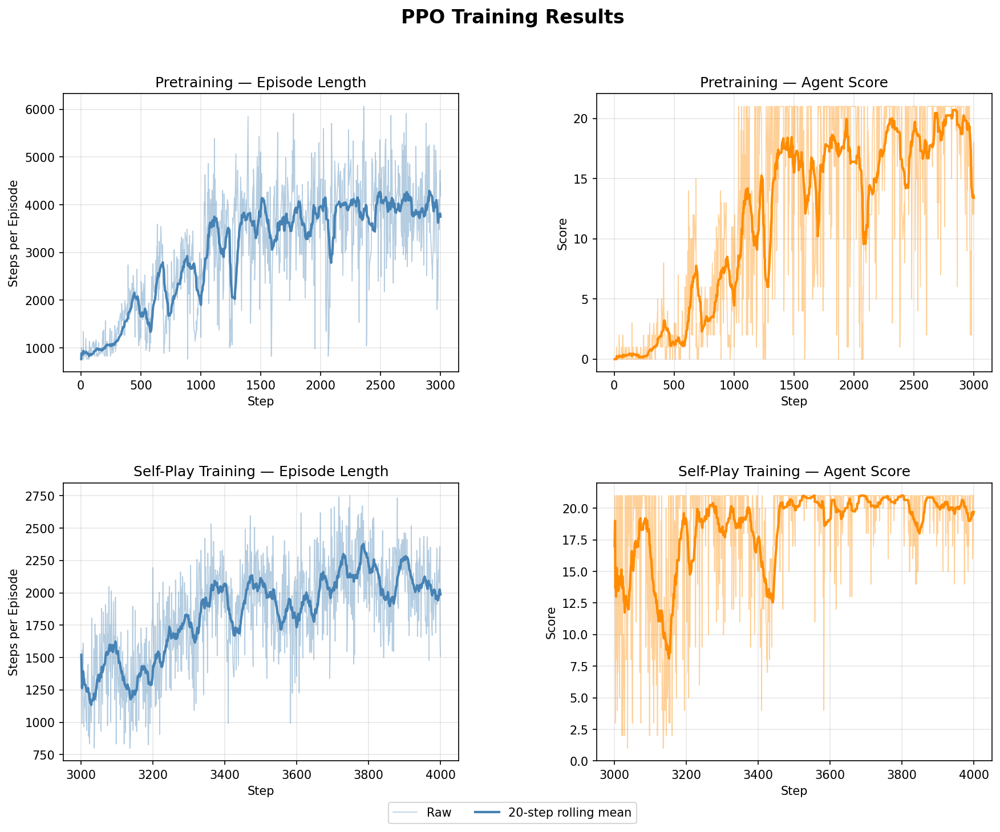

# RL_Self_Play
A repo training RL agents using self-play, the technique of having an agent compete with itself or a recent version of itself so the difficulty of the opponent increases with the skill of the agent. Self-play is behind the best performances of machine learning in zero sum environments like competitive games, most famously in Chess with AlphaZero. 

## Implemented Environments

The only environment currently implemented is Pong, which was my chosen first environment due to its familiarity and simplicity. More environments may be added in the future.

### Pong
Train an agent to play the classic Atari game Pong in the pong directory. A vanilla actor critic agent and an actor critic PPO agent are implemented with the focus being on the PPO agent, which achieves good performance. The PPO agent implements training against the standard built-in Atari opponent as a pretraining phase then self-play to further improve the agent.

More information <a href="pong/README.md">here</a>.
