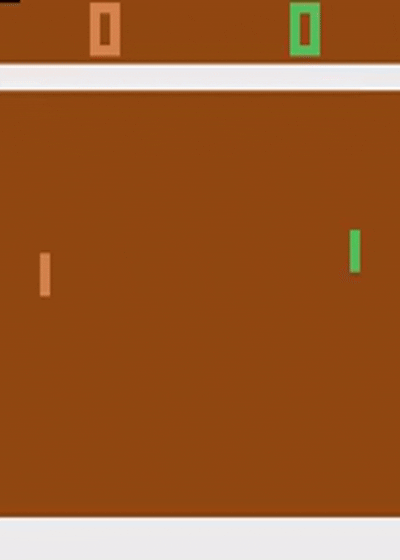
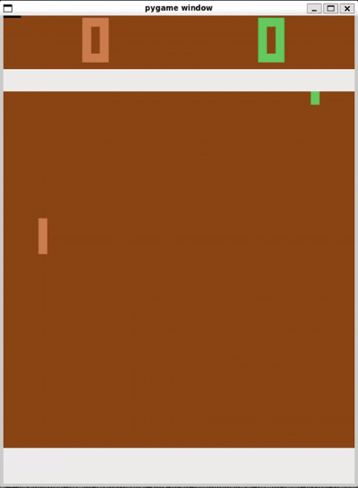

# Pong
The goal is to play the classic Atari game Pong, where players control a paddle and gain points by getting the ball past the opponent's paddle.

## Setup/Usage

1. Install requirements (recommended you do this inside a virtual environment like <a href="https://docs.python.org/3/library/venv.html">venv</a>)
    ```bash
    pip install -r requirements.txt
    ```
    If you'd rather install requirements manually, the primary requirements are <a href="https://pytorch.org/">PyTorch</a>, <a href="https://ale.farama.org/">Farama ALE</a>, and <a href="https://pettingzoo.farama.org/">Farama PettingZoo</a>.
1. Run pretraining.py after choosing the parameters at the top of the file appropriately
    ```bash
    python ppo/pretraining.py
    ```
1. Run training.py after choosing the parameters at the top of the file appropriately
    ```bash
    python ppo/training.py
    ```

## PPO


Episode length is the primary metric I monitored to assess agent performance since better agents more reliably return the ball and continue the rally. This assumption breaks down if the agent is good enough to always hit the ball in such a manner that the opponent can't return it but no agent I trained reached that level of performance. During pretraining the agent score is another key metric of performance since the opponent is fixed. During self-play training the agent score matters less, but gives some indication if the agent is much better than the opponent pool or if they are evenly matched.

### Pretraining
This file (pretraining.py) implements training an agent on the standard Atari Pong gym environment (environment details <a href="https://ale.farama.org/environments/pong/">here</a>). The gifs below show that the agent can exploit that the built-in opponent can't move vertically sufficiently fast to stop a ball with extra vertical speed. The agent's preferred strategy seems to be sitting on the edge of the screen then aggressively moving up or down when the ball gets close to give the ball the required extra vertical speed. The agent does sometimes struggle if the ball is in the middle of the screen coming towards it and sometimes makes no real attempt to get the ball so overall struggles with generality outside of its preferred strategy. This does improve between the episode 2000 and 3000 versions of the agent and pretraining further would likely resolve these shortcomings.

Self-play was first attempted after the agent was pretrained for 2000 episodes but the agent failed to learn during this attempt. This is because if the agent can't hit the ball consistently almost no learning signal is present so the agent never gets better (at least within the training budget I allotted, perhaps if run longer bootstrapped self-play would work). The gif below shows a sample rally of the agent trained to 2000 episodes playing against the built-in opponent.


Pretraining was then extended for another 1000 episodes to 3000 episodes total and self-play was attempted again, this time successfully. This gif shows a sample rally of the agent trained to 3000 episodes playing against the built-in opponent.


### Self-Play Training
This file (training.py) implements training an agent via self-play. The graphs above show that the episode length decreases significantly at the start of the self-play training phase relative to the end of the pretraining phase. This is due to the self-play opponent not hitting it back as reliably as the built-in opponent. The self-play opponent is either a random opponent or a previous agent, determined by sampling from a queue of previous opponents to try to avoid circular behavior. The episode length does increase as the self-play training phase progresses, showing that the self-play training is working and the agent's increased skill is manifesting as longer rallies.

This gif shows a sample rally of the agent trained using self-play for 1000 episodes (to episode 4000 total) playing against itself.



### Future Improvements
To achieve higher agent performance the simplest thing to do is to increase the model capacity. I've used a relatively small model for training convenience and expect that a larger model would do better. Different architectures could also be explored or techniques beyond straightforward PPO could be used to increase sample efficiency like model based RL (e.g. DreamerV3).

## Vanilla Actor Critic
This folder implements self-play for a standard REINFORCE actor critic. Pong turns out to be a bit too complicated for this technique to work well, with it often leading to policy collapse, as in the gif below. The agent is the paddle on the right and the paddle on the left is a random opponent.



This is from an experiment trying to bootstrap self-play with a random opponent and shows the strong advantage of serving against a poor opponent as well as the non-random behavior of serves (since this policy does somewhat consistently return a serve). This also shows the importance of the trust region (TRPO) intuition behind PPO, which increases stability and helps avoid collapse. 